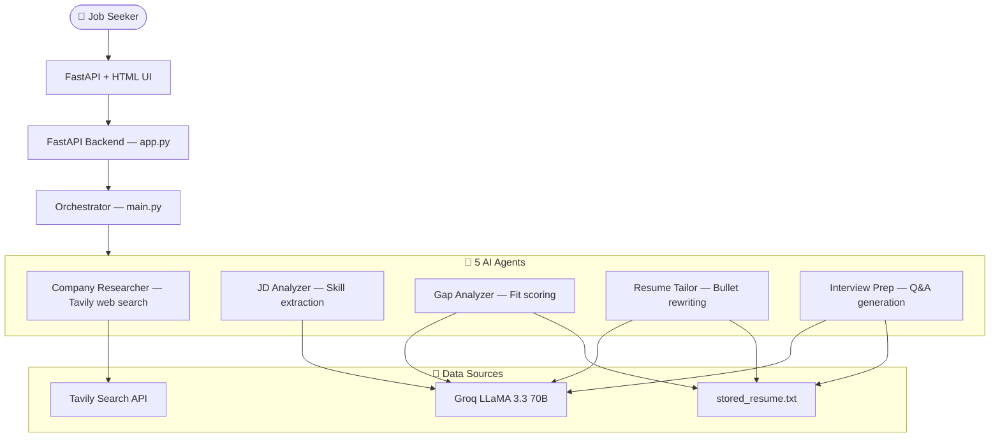

An AI-powered job application intelligence system. Paste a job description, upload your resume, and get company research, gap analysis, tailored resume bullets, and interview prep — all in under 60 seconds.

## Demo

🔗 **Live:** https://huggingface.co/spaces/aditya1401/career-agent


## Architecture



---

## Features

- **Company Research** — Live web search on the company, recent news, tech stack, culture
- **JD Analysis** — Extracts required skills, nice-to-haves, seniority, ATS keywords
- **Gap Analysis** — Honest fit score (0-100) with matched skills, gaps, and hire recommendation
- **Resume Tailoring** — Rewrites your resume bullets using JD keywords without fabricating experience
- **Interview Prep** — 5 technical questions, 3 behavioral STAR answers, questions to ask, watch-out areas
- **Resume Upload** — Upload once (PDF, DOCX, TXT), stored for all future analyses

---

## Tech Stack

| Layer | Technology |
|-------|-----------|
| LLM | LLaMA 3.3 70B via Groq |
| Web Search | Tavily API |
| Backend | FastAPI + Uvicorn |
| Frontend | HTML / CSS / Vanilla JS |
| Resume Parsing | pdfplumber, python-docx |
| Deployment | Docker on Hugging Face Spaces |

---

## Agents

| Agent | Input | Output |
|-------|-------|--------|
| `company_researcher` | Company name | Research briefing with news, tech stack, culture |
| `jd_analyzer` | JD text | Structured skill extraction + ATS keywords |
| `gap_analyzer` | Resume + JD analysis | Fit score, gaps, competitive advantages |
| `resume_tailor` | Resume + JD | Rewritten bullets with JD keywords |
| `interview_prep` | Resume + JD + Company | Questions, STAR answers, watch-out areas |

---

## Setup

### Prerequisites
- Groq API key (free at [console.groq.com](https://console.groq.com))
- Tavily API key (free at [tavily.com](https://tavily.com))

### Installation

```bash
git clone https://github.com/adii1401/career-agent.git
cd career-agent
pip install -r requirements.txt
```

### Configuration

Create a `.env` file:
```env
GROQ_API_KEY=your_groq_key
TAVILY_API_KEY=your_tavily_key
```

### Run

```bash
python app.py
```

Open [http://localhost:7860](http://localhost:7860)

---

## Project Structure

```
career-agent/
├── app.py                  ← FastAPI backend
├── main.py                 ← Orchestrator
├── resume_store.py         ← Resume upload and storage
├── agents/
│   ├── company_researcher.py
│   ├── jd_analyzer.py
│   ├── gap_analyzer.py
│   ├── resume_tailor.py
│   └── interview_prep.py
├── static/
│   └── index.html          ← Dark theme UI with tabs
├── requirements.txt
├── Dockerfile
└── .dockerignore
```

---

## Related Projects

- [MFT Operations Agent](https://github.com/adii1401/mft-operations-agent) — Project 2: AI chat agent for MFT operations
- [MFT Email Responder](https://github.com/adii1401/mft-email-responder) — Project 1: RAG-based email automation

---

Built as part of an AI Automation Engineer portfolio.